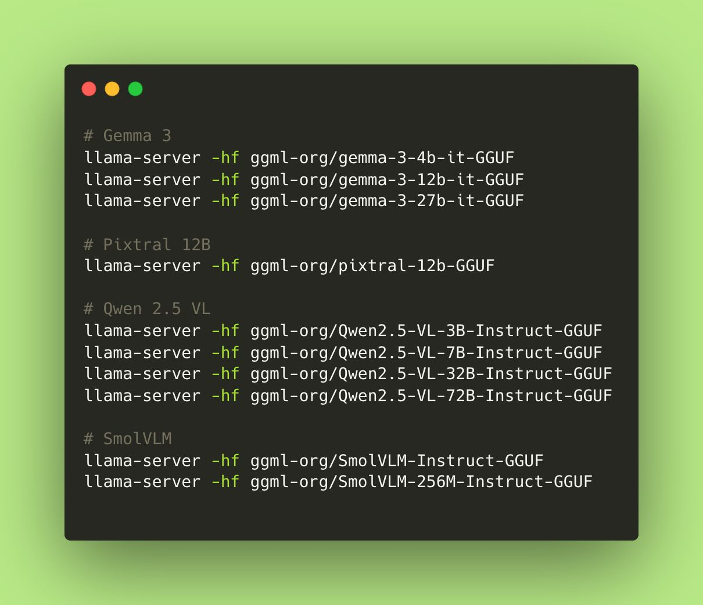

# llama.cpp compatible with VLMs

[ref.](https://www.linkedin.com/posts/julienchaumond_attention-llamacpp-server-and-web-ui-activity-7326962749656215552-RgTm?utm_source=social_share_send&utm_medium=member_desktop_web&rcm=ACoAADcQ-awBr3u930Xz6R9PwapKbU91o3SW-UQ)


```sh

llama-server -hf ggml-org/gemma-3-4b-it-GGUF

```